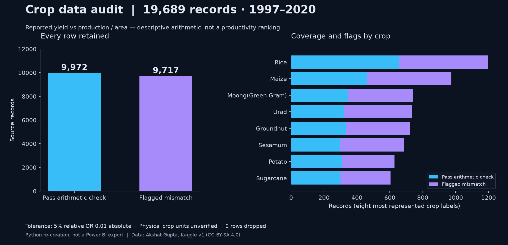
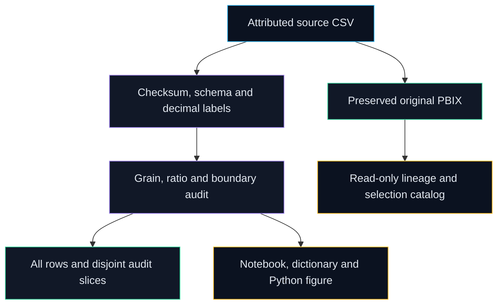

# Crop Data Quality Audit

Reproduce quality checks and trace an original Indian crop Power BI report without hiding uncertain units.

[](https://github.com/Prajwal-Pratap-Yadav/Analyzing-Agricultural-Productivity-Across-Indian-States-Power-BI/actions/workflows/ci.yml)
[](LICENSE)
[](pyproject.toml)
[](CHANGELOG.md)



*Python re-creation, not a Power BI export. Data: Akshat Gupta, Kaggle v1, CC BY-SA 4.0.*

## Why this matters

- **Problem:** mixed crop units, yield definitions and historical boundaries can make polished agricultural dashboards misleading.
- **Approach:** preserve original data/report bytes; audit decimal values, record grain and explicit arithmetic tolerances; extract the model read-only.
- **Outcome:** reproducible review evidence retains every row and makes unresolved assumptions visible before interpretation.

## Quickstart

Requires Python 3.11 or 3.12, Git and Make on Linux. Three commands run the real included, attributed source audit:

```bash
git clone https://github.com/Prajwal-Pratap-Yadav/Analyzing-Agricultural-Productivity-Across-Indian-States-Power-BI.git
cd Analyzing-Agricultural-Productivity-Across-Indian-States-Power-BI && make setup
make run
```

Outputs: `data/processed/cleaned.csv`, `ratio_check_pass.csv`, `ratio_mismatches.csv` and `validation_report.json`. The CSV audit has no third-party runtime dependencies; setup installs locked build/bootstrap tools. For the full figure/notebook, run `make setup-dev reproduce`. The original report requires Power BI Desktop for a [manual refresh](docs/refresh.md).

## Features

- Exact source checksum, bounded UTF-8 schema, finite/nonnegative numbers, positive area and unique canonical grain.
- Trimmed labels and a documented historical alias map; fractional area and reported yield retained.
- Separately calculated production/area ratio, explicit pass/mismatch slices and boundary-review flags; zero hidden row loss.
- Generated dictionary, executed notebook insight cells and a reproducible companion figure.
- Sanitized original M/schema/visual-selection catalog and cached-table arithmetic cross-checks; one table, six pages, zero explicit DAX measures.
- Tested standalone CLI, synthetic packaged demo, hash-locked tooling and CPU CI.

## Architecture



The companion pipeline reads the original CSV and keeps reported yield alongside a diagnostic ratio. Optional PBIXRay extraction reads the report's cached model and M without changing the binary. [Architecture](docs/architecture.md) and [lineage](docs/lineage.md) explain the separate paths and their limits.

## Design decisions

| Decision | Alternatives rejected | Why | Trade-off |
|---|---|---|---|
| [Preserve the report](docs/adr/0001-preserve-report.md) | Unvalidated binary edits | Retain inspectable original evidence | Desktop refresh/output confirmation remains manual |
| [Retain yield and decimal area](docs/adr/0002-yield-policy.md) | Silent replacement or crop-unit guesses | Separate arithmetic from uncertain measurement semantics | Passing a tolerance check does not certify accuracy |
| [Separate environments](docs/adr/0003-separate-environments.md) | Heavy model/graphics dependencies for every audit | Fast offline runtime and optional inspection | Full reproduction needs developer setup |

## Results and limitations

**Measured source diagnostics:** 19,689 rows retained; 55 crop labels; 30 state/UT labels; six seasons; 1997–2020. **9,717** reported-yield mismatches (**49.35%**) under the declared decimal tolerance; **9,972** rows pass. **235** fractional areas were changed in the original integer cache; **141** records are flagged for boundary review. Exact numbers and methods are linked to [executed notebook cells](notebooks/01_etl.ipynb), [insights](docs/insights.md), [validation JSON](reports/validation_report.json) and [EVIDENCE](docs/EVIDENCE.md).

The verified matching Kaggle source is CC BY-SA 4.0. Primary government lineage, per-crop production units, yield weighting and historical harmonization are unverified. No cross-crop productivity ranking, causal fertilizer/rainfall claim or official-government-data claim is supported. Metadata extraction and Python arithmetic are **not validated against Power BI output**; the original report has not been refreshed or rendered here. Read [DATA](docs/DATA.md) before interpreting fields.

**Synthetic fixture:** the installed wheel's `crop-audit --demo --output demo-output` exercises packaging only; its three invented records are not agricultural findings.

## Repo map

| Path | Purpose |
|---|---|
| `src/etl/` | Typed extract, clean, validate, export and CLI |
| `data/raw/`, `data/source-receipt.json`, `data/LICENSE.md` | Original CSV, verified source/hash and licence scopes |
| `powerbi/original/` | Byte-preserved report and historical README |
| `configs/`, `tests/` | Explicit policy and adversarial/end-to-end tests |
| `notebooks/01_etl.ipynb` | Actual outputs of named plain-Python insight cells |
| `docs/`, `reports/` | Dictionary, lineage, ADRs, limits and measured evidence |
| `scripts/`, `.github/` | Reproduction, validation, security, CPU CI and releases |

## Development

| Command | Purpose |
|---|---|
| `make setup` / `make setup-dev` | Locked runtime / developer tools and staged hooks |
| `make lint typecheck test` | Lint, formatting, strict package types and meaningful tests |
| `make run` / `make reproduce` | Audit / regenerate exports, figure, docs and notebook stdout |
| `make setup-inspect inspect` | Python 3.12 read-only extraction and catalog-drift check |
| `make docs build security` | Links/schema/file bounds, wheel/sdist, history and advisory checks |
| `make clean` | Remove generated local exports/caches/builds |

[Contributing](CONTRIBUTING.md) explains evidence and preservation requirements. Runtime and default CI support Linux Python 3.11/3.12; optional inspection is locked for Python 3.12. Other operating systems and Power BI UI behavior are unverified.

## Roadmap

[Next audited report milestone](https://github.com/Prajwal-Pratap-Yadav/Analyzing-Agricultural-Productivity-Across-Indian-States-Power-BI/milestone/1):

- [Desktop refresh, decimal area and genuine page exports](https://github.com/Prajwal-Pratap-Yadav/Analyzing-Agricultural-Productivity-Across-Indian-States-Power-BI/issues/1).
- [Primary per-crop unit and state-boundary provenance](https://github.com/Prajwal-Pratap-Yadav/Analyzing-Agricultural-Productivity-Across-Indian-States-Power-BI/issues/2).
- [Reviewed PBIP export guide](https://github.com/Prajwal-Pratap-Yadav/Analyzing-Agricultural-Productivity-Across-Indian-States-Power-BI/issues/3) — good first issue.

## License, data and citation

Original [MIT code licence](LICENSE) retained. The real dataset and distributed adaptations/figures use **CC BY-SA 4.0**, attributed to **Akshat Gupta**, with modification notes in [data/LICENSE.md](data/LICENSE.md); the code licence does not relicense the data. The wheel contains an explicitly synthetic MIT fixture. Cite software via [CITATION.cff](CITATION.cff) and credit the source dataset separately. [Security](SECURITY.md) and [conduct](CODE_OF_CONDUCT.md) policies apply to contributions.
