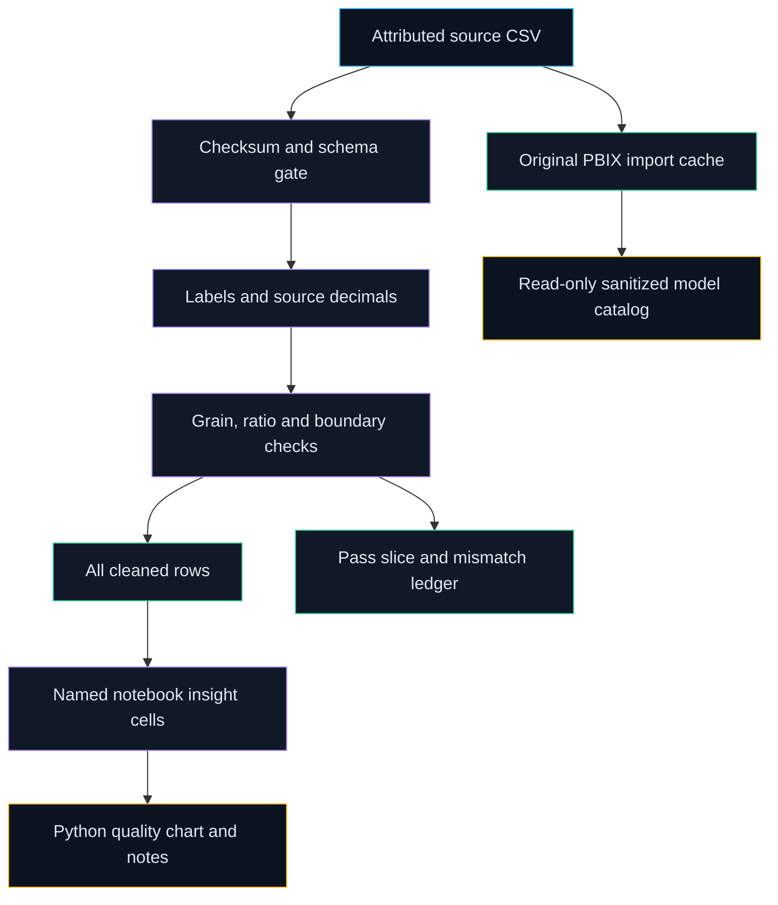

# Architecture

The runtime is a dependency-free Python package: `extract` checks the exact source SHA256, size, encoding and ten-column schema; `clean` trims labels, maps explicit historical aliases and preserves decimal fields; `validate` checks grain and separates reported-versus-derived arithmetic; `export` writes three deterministic CSVs and the validation JSON. The source CSV and original Power BI report remain independent, byte-preserved evidence.

`crop-audit` / `python -m etl` is the entry point. It needs no network or Power BI. `make reproduce` adds a matplotlib figure, generated dictionary/insights and sequential execution of plain-Python notebook cells. It captures actual stdout in the notebook; this mode uses no Jupyter kernel and supports the notebook's ordinary Python cells. It is not a general notebook runner. Data results are deterministic; manifests record source/version/environment and execution time without pretending every environment creates the same figure bytes.

The optional PBIXRay 0.15.5 inspection environment is Python 3.12 and hash-locked separately. It reconstructs tables and metadata read-only, checks cached/source grain agreement and compares pandas arithmetic on the cache with decimal CSV arithmetic. It cannot refresh the source, evaluate DAX, validate visual filters or render a report. No silent unit conversions or historical border corrections occur.

Every export includes data attribution/licence in the adjacent JSON. The wheel contains code and a clearly synthetic MIT fixture, not the real source dataset or original report. The separately licensed evidence release contains the attributable data/report/derived outputs and notices.
