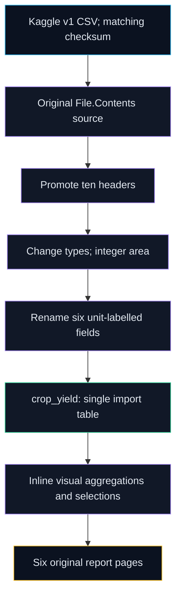

# Extracted report lineage

[PBIXRay's read-only API](https://www.pbixray.com/docs/) extracted the original model on October 4, 2026. The [machine-readable catalog](../reports/model/catalog.json) includes the SHA256, schema, sanitized full M expression and every page/visual selection. Extraction succeeded: one import table, 19,689 cached rows, zero relationships, zero calculated columns and zero explicit DAX measures. This is not a report render or refresh.

The source path is machine-specific and redacted in the published text catalog. `Csv.Document` uses comma delimiter, ten columns, Encoding 1252 and QuoteStyle.None. `Table.PromoteHeaders` creates headers. `Table.TransformColumnTypes` uses Int64 for year, area and production and numbers for rainfall/inputs/yield. `Table.RenameColumns` adds declared units to display names. There is no trimming, state mapping, ratio validation or boundary treatment in the extracted query. The integer area conversion changes 235 cached values relative to the CSV; [arithmetic evidence](../reports/model/arithmetic-crosschecks.json) records this. The companion pipeline imports the original CSV rather than treating the rounded cache as source truth.

| Page | Visual count | Observed visual types / intent |
|---|---:|---|
| Page 1 | 10 | Text, cards, rainfall/production scatter, production by state, navigation button |
| Page 2 | 3 | Mean reported yield by state, rainfall/production line, crop slicer |
| Page 3 | 3 | Production by crop-year, state slicer, rainfall/count ribbon |
| Page 4 | 4 | Fertilizer/pesticide pie/donut selections |
| Page 5 | 1 | Key drivers visual configuration; no evaluated insight extracted |
| Page 6 | 1 | State/season table with inline sums |

Counts describe archive configuration, not a successful rendered visual. Cross-crop production/yield and repeated rainfall/input aggregations have semantic limitations documented in [DATA.md](DATA.md). The key-driver page supplies no basis for causal conclusions. [Desktop confirmation](refresh.md) remains manual.
